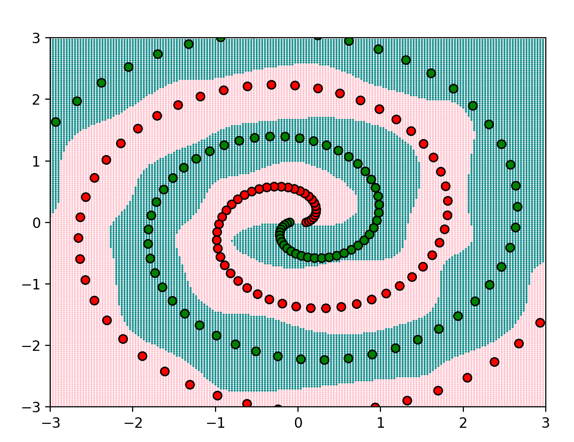
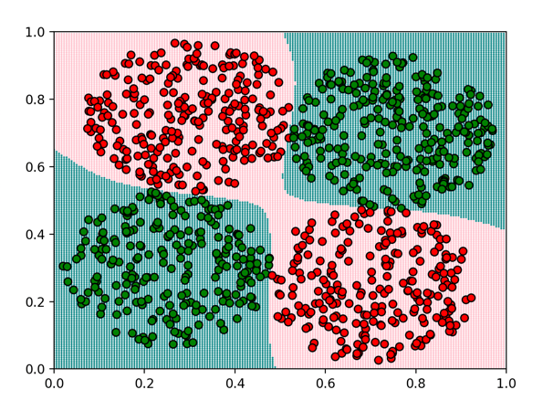

# MLL

### A machine learning library (MLL), in Python & Cython

<p align="center">
  
  
</p>

This is a machine learning library, made from scratch to challenge myself. No tutorials or previous
code implementation of these Ml models were used.
  

#### It implements:  
* Decision Trees - CART (which are highly performant, near sklearns implemenation)  
* Random Forests - using ensembles of these Decision Trees  
* Rotation Forests - An atypical variant of Random Forests (which allow for non-orthogonal decision boundaries)
* Sequential Neural Networks with different activations and erros
(for classification and regression tasks)

* Support Vector Machines (several variations)  
* Logistic Regression  
* Linear Regression
* A suite of useful tools for data cleaning, preparation, and visualisation
* Some toy data sets generators


### Setup:  
Clone the repo:  

	git clone https://github.com/DdkCode/MLL

Navigate to the repo and install the prerequistes:
*Note, only NumPy, Cython & SciPy are actually required - the rest are just needed for comparisons and visualisation* 

	pip install -r requirements.txt
    
Build Cython files:
  
	python setup.py

Use the library - *to see some demonstrations of the library in action run:*

	python main.py

### Example Usage:

```python

from package.Models.Neural_Network import SequentialNeuralNetowrkClassifier
from package.Tools import LabelEncoder, split_test_train, map_categorical
from package.data import load_data

# DATA:
xs, ys = load_data()

# Clean/Pre-process
le = LabelEncoder()
le.build(ys)
ys_enc = le.fit_transform(ys)
x_train, x_test, y_train, y_test = split_test_train(xs, ys_enc, 0.25)
ys_train_ohe = map_categorical(y_train, <NUM_CATEGORIES>)  # Maps i -> [0, ..., 1, ..0] in the i-th position

# Initialise and train model:
snn = SequentialNeuralNetworkClassifier(
	<INPUT_DIM>,
	<NUM_CATEGORIES>,
	INTERNAL_LAYERS = [16, 16], 
	EPOCHS = 200,
	learning_rate = 0.01
)
snn.train(x_train, ys_train_ohe)

# Get test results:
result = snn.test(x_test, y_test)
print(f"F1-macro - {result.f1.average_score()}")

```
	
    
